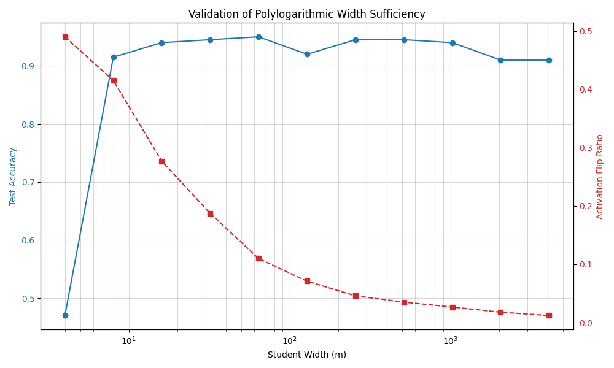

# Polylog-Width-ReLU-Convergence

This repository contains a numerical verification of the theoretical results presented by **Ji and Telgarsky (2019)** in *"Polylogarithmic width suffices for gradient descent to achieve arbitrarily small test error with shallow ReLU networks"*.

The experiment validates that shallow ReLU networks can achieve global convergence and strong generalization with a width $m$ that scales only polylogarithmically with respect to the inverse error $1/\epsilon$, rather than the polynomial scaling required by standard Neural Tangent Kernel (NTK) theory.

## Objectives
1. **The Margin Assumption**: Validate that random initialization provides a "lucky" feature space where a separator $\bar{U}$ exists in the gradient space $\nabla f_i(W_0)$.
2. **Activation Stability**: Verify that the number of ReLU activation flips is bounded even in the narrow polylog-width regime.
3. **Generalization Jump**: Observe the sharp phase transition in test accuracy as $m$ increases.

## Experimental Design: Teacher-Student Setup

We implement a **Teacher-Student** framework to provide a ground-truth labeling function:
* **Teacher**: A fixed, global ReLU network $f^*$ that defines the decision boundary.
* **Student**: A network of variable width $m$ trained to recover the teacher's manifold.
* **Optimization**: Gradient Descent (GD) on the logistic loss.

### Final Configuration
* **Environment**: Python 3.10, run `pip install --file requirements.txt`
* **Parameters**: $D=50, K=2, N=2000, LR=0.1, \text{Margin Filter}=0.3$ -> Can be changed in script file.
* **Experiment**: run `python -m scripts.teacher_student_experience`

## Key Results
Our simulation confirms the paper's main thesis: a sharp generalization jump occurs at very small widths ($m \approx 8$), while the **Activation Flip Ratio** declines as $m$ increases, confirming the stability of the ReLU gates during optimization.



## Repository Structure

```text
├── src/
│   ├── model_utils.py       # Student/Teacher architectures & 1/sqrt(m) scaling
│   ├── data_generator.py    # Global Teacher-based data generation & margin filtering
│   └── trainer.py           # GD implementation with MPS support & flip tracking
├── scripts/
│   └── teacher_student_experience.py # Main width-sweep execution script
├── requirements.txt         # Dependencies (torch, matplotlib, numpy)
└── README.md 